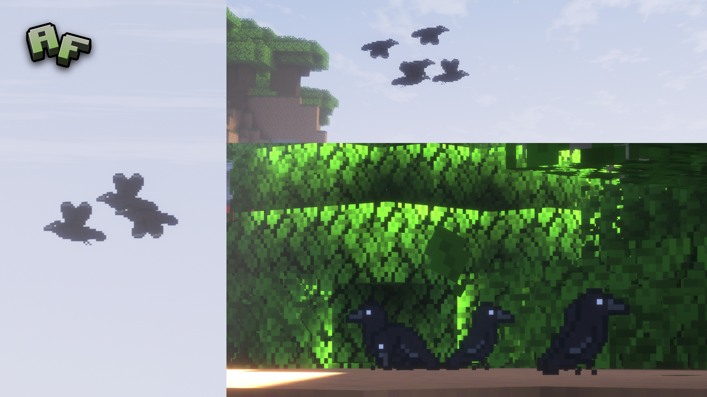

Minecraft mod that adds birds and other fauna making your world feel alive. Hugely inspired by the amazing mod [Cosy Critters & Creepy Crawlies](https://modrinth.com/mod/cosy-critters).

---

## Project Status

This mod is currently in **early development**. A lot of features might be missing or be buggy. Please be patient and report any issues you find!

---

## Description

**Atmospheric Fauna** is a **Fabric** mod which I created just to fix the lonely atmosphere of Minecraft. I decided to add _(inspired by [Cosy Critters & Creepy Crawlies](https://modrinth.com/mod/cosy-critters))_ particle based birds that can fly around and interact with the world. The birds will all spawn in different biomes and have different behaviors. Some will like to be alone and some will like to be in flocks. Some will be scared of players and some will be curious. I want the mod to feel alive and dynamic, so the birds will react to the environment and the player in different ways.

My plan right now is to build a solid foundation for the mod, so I can easily add as many birds in the future as I want. So far I've used crows as a base bird, but later on I plan on adding a vultures and maybe some smaller birds like sparrows or robins. I'm also using this as a way to learn about modding and coding in Java, because it's something I've wanted to learn for a long time (also I might learn some pixel art as well).

---

## Birds

Crows

Can spawn in any Overworld biome. Can only spawn on dirt, leaves, logs, sand, snow, and stone blocks. They spawn in flocks of 3-9 birds. Will fly away if the player gets too close. Their behaviour is still work in progress.

_More birds will be added in the future!_

---

## Installation

Just make sure you have the latest version of [Fabric Loader](https://fabricmc.net/) and [Fabric API](https://modrinth.com/mod/fabric-api) installed.

For the best experience I recommend using this alongside with [ModMenu](https://modrinth.com/mod/modmenu) and [Cloth Config](https://modrinth.com/mod/cloth-config) to be able to customize the mod to your liking.

---

## Contributing

I welcome all contributions!
If you have feedback, bug reports, or improvements:

- Open an issue on [GitHub](https://github.com/RealNmS/Atmospheric-Fauna)
- Submit a pull request
- Share and star the project ⭐
