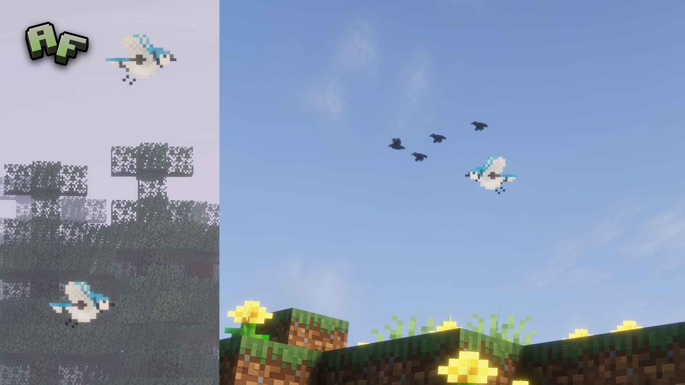
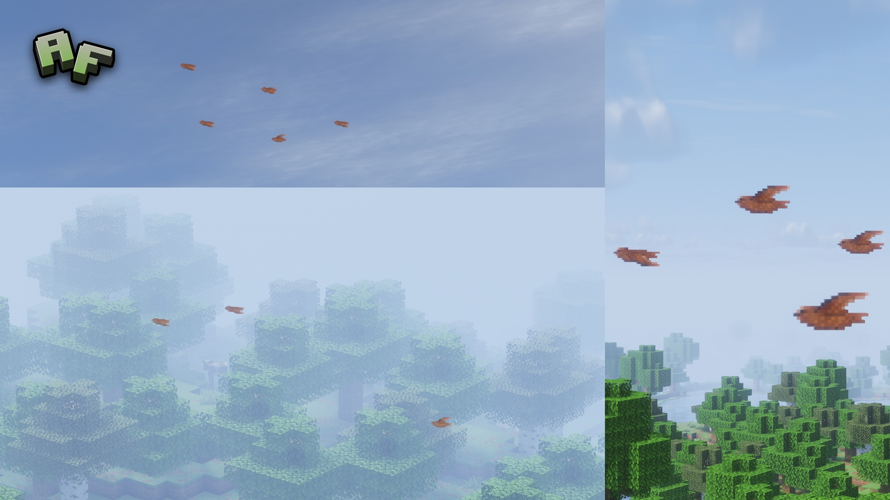
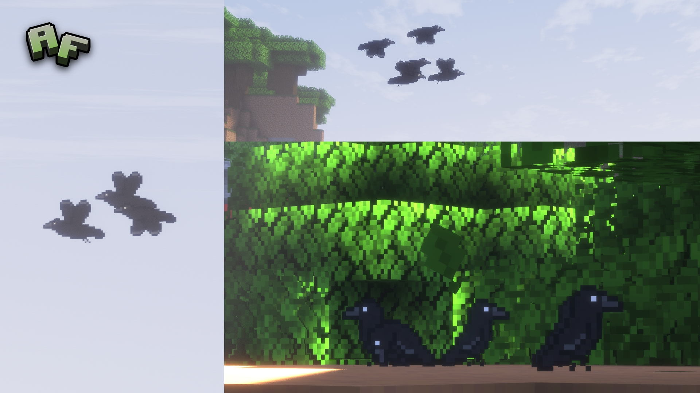
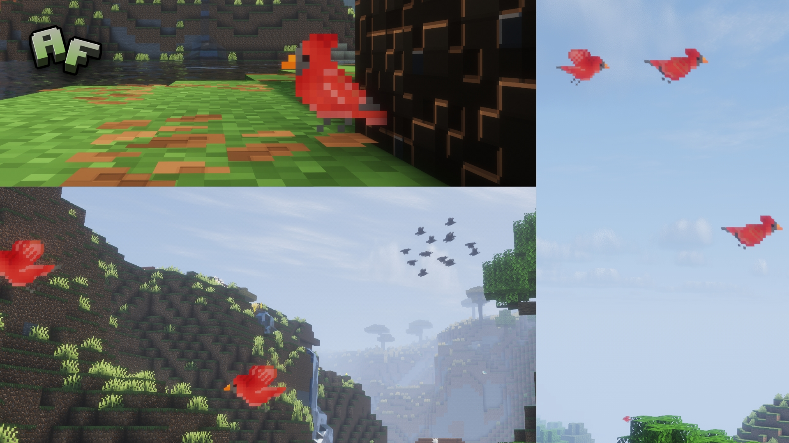

Minecraft mod that adds birds and other fauna making your world feel alive. Very customizable, cozy and focused on vanilla-like feeling.

---

> [!WARNING]
> This mod is currently in **early development**. A lot of features might be missing or be buggy. Please be patient, as I don't have a lot of free time, and report any issues you find!

---

## Description

**Atmospheric Fauna** is a **Fabric** mod which I created just to fix the lonely atmosphere of Minecraft. I decided to add _(hugely inspired by the amazing mod [Cosy Critters & Creepy Crawlies](https://modrinth.com/mod/cosy-critters))_ particle based birds that can fly around and interact with the world. The birds will all spawn in different biomes and have different behaviors. Some will like to be alone and some will like to be in flocks. Some will be scared of players and some will be curious. I want the mod to feel alive and dynamic, so the birds will react to the environment and the player in different ways while trying my best to maintain reasonable performance.

My plan right now is to build a solid foundation for the mod, so I can easily add as many birds in the future as I want. If you are interested in seeing what my future plans are, check out the [CHANGELOG](https://github.com/RealNmS/Atmospheric-Fauna/blob/main/CHANGELOG.md). I'm also using this as a way to learn about modding and coding in Java, because it's something I've wanted to learn for a long time (might learn some pixel art as well).

---

## Birds

### Blue Jays

### Common Swifts

### Crows

### Northern Cardinals

> _More birds will be added in the future!_

> [!TIP]
> For more information about the birds and their spawn conditions, check out the [Wiki](https://github.com/RealNmS/Atmospheric-Fauna/wiki).

---

## Installation

Just make sure you have the latest version of [Fabric Loader](https://fabricmc.net/) and [Fabric API](https://modrinth.com/mod/fabric-api) installed. For the best experience I recommend using this alongside with [Mod Menu](https://modrinth.com/mod/modmenu) and [Cloth Config](https://modrinth.com/mod/cloth-config) to be able to customize the mod to your liking.

For installation on **NeoForge** I recommend using [Sinytra Connector](https://modrinth.com/mod/connector), which is compatible with this mod. To edit the config file, you should use [Connector Extras](https://modrinth.com/mod/connector-extras) and [Cloth Config (NeoForge)](https://modrinth.com/mod/cloth-config).

The mod is completely **client-side**, so you don't need to install it on the server. As of now, there is no server-side functionality.

---

## Honorary Mentions

- [Atmospheric Fauna: Unofficial Fabric Port](https://modrinth.com/mod/atmospheric-fauna-unofficial-fabric-port) by **Aarow** *(1.20.1 port of this mod)*

---

## Contributing

I welcome all contributions!
If you have feedback, bug reports, or improvements:

- Open an issue on [GitHub](https://github.com/RealNmS/Atmospheric-Fauna)
- Submit a pull request
- Share and star the project ⭐
